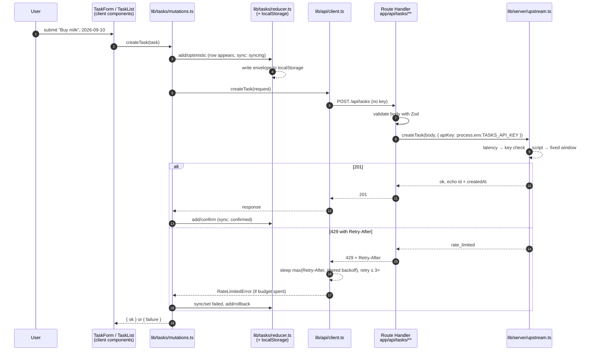

# 01 · Architecture overview

> **In one paragraph.** A single Next.js application with two pages, two
> Route Handlers, and one in-process simulated upstream. The browser holds
> all user data (`localStorage`) and the session (`sessionStorage`); the
> server holds exactly one thing the browser must never see, the API key. Every
> add and delete crosses the network to a Route Handler, which presents the key
> to the upstream and passes the answer back. State on the client is a reducer
> behind a provider; the optimistic apply, reconcile and rollback live in that
> reducer and one orchestration module, not in components.

## The concept: one deployable, two execution contexts

Next.js is one codebase that compiles into two programs: a server bundle (Route
Handlers, Server Components, layouts) and a client bundle (everything marked
`"use client"` and its imports). The most important architectural question in
any Next app is *which side does each module run on*, because the answer
decides what can read `process.env`, what can touch `window`, and what ends up
in a file every visitor downloads.

This codebase draws that line explicitly, and then proves it with tests
([page 14](14-ci-and-security.md)). Everything under `lib/server/` and
`app/api/` is server-only; everything that touches the DOM or a storage API is
a client component; the types in `types/` and the schemas in `lib/tasks/schema.ts`
are shared, and shared is safe because they contain no behaviour that depends
on either side.

## The request path



Three things to notice, each expanded on its own page:

1. **The row is on screen at step 3, before any network happens.** That is what
   "optimistic" means, and the reducer is the only thing that knows how to put
   it there and take it back ([page 08](08-optimistic-mutations.md)).
2. **The key enters the picture at step 8, on the server.** The browser's
   request at step 6 carries nothing secret. The Route Handler is a
   backend-for-frontend that holds the credential on the browser's behalf
   ([page 06](06-api-simulation.md)).
3. **The retry loop at step 13 never sees a component.** The client is a
   pure function of responses and a sleep; the components see one promise
   ([page 07](07-resilient-client.md)).

## The module map

```
app/
  layout.tsx                  root layout: <html>, global CSS, metadata          (server)
  page.tsx                    "/"  → redirect by auth state                      (server shell, client guard)
  login/page.tsx              "/login" → the form, the non-production notice     (server shell)
  login/login-form.tsx        the form                                           (client)
  (protected)/layout.tsx      AuthProvider → RequireAuth → TasksProvider → page  (server shell, client tree)
  (protected)/tasks/page.tsx  "/tasks" → <TaskForm/> above <TaskList/>           (server shell)
  api/tasks/route.ts          POST   → createTaskHandler(productionDeps)         (server)
  api/tasks/[id]/route.ts     DELETE → deleteTaskHandler(productionDeps)         (server)

lib/
  api/config.ts               retry + simulation config; every knob in one place (shared)
  api/retry.ts                backoff, jitter, Retry-After parsing — pure         (shared)
  api/client.ts               fetch + timeout + bounded retry; the error classes  (client)
  auth/credentials.ts         the credential rule — pure                          (shared)
  auth/session.ts             sessionStorage adapter + Zod schema                 (client-safe)
  auth/provider.tsx           AuthProvider, useAuth                               (client)
  auth/guards.tsx             RequireAuth, RedirectIfAuthenticated, RedirectBy…   (client)
  auth/session-bar.tsx        "Signed in as", Log out                             (client)
  server/env.ts               readApiKey — the ONLY reader of TASKS_API_KEY       (server)
  server/handlers.ts          the two handlers as functions, deps injected        (server)
  server/upstream.ts          the simulated third-party API                       (server)
  tasks/actions.ts            the TaskAction union — frozen contract              (shared)
  tasks/schema.ts             Zod field schemas + persisted envelope — frozen     (shared)
  tasks/reducer.ts            tasksReducer, PERSISTING_ACTIONS — pure             (shared)
  tasks/storage.ts            localStorage adapter                                (client-safe)
  tasks/provider.tsx          TasksProvider: reducer + hydration + write trigger  (client)
  tasks/hooks.ts              useTasks, useTasksHydrated, useTaskDispatch         (client)
  tasks/validation.ts         validateTaskInput, isOverdue — pure                 (shared)
  tasks/mutations.ts          createTask/deleteTask sequences, useTaskMutations   (client)
  utils.ts                    cn()                                                (shared)

components/
  ui/**                       shadcn primitives (Radix + Tailwind); no domain imports
  ui/live-region.tsx          the one announcement mechanism (a pub/sub bus)
  tasks/task-form.tsx         add-task form
  tasks/task-list.tsx         sort, filter, empty states, focus management
  tasks/task-item.tsx         one row
  tasks/task-filters.tsx      URL-held filter + the toggle group

types/
  task.ts                     Task, SyncState, Filter — frozen contract
  api.ts                      HTTP contract + the Upstream interface — frozen
```

"Shared" means importable from either side without harm: the module touches
neither `window` nor `process.env` at import time, and does nothing at module
load. That last clause matters more than it looks. `lib/tasks/storage.ts`
resolves `window.localStorage` *lazily, per call*, so importing it into a
server-rendered tree is safe (`AC-STATE-6`); a module that captured
`window.localStorage` at the top level would crash the server render.

## The three layers of the client

Reading top-down through the client bundle:

| Layer | Modules | Knows about |
|---|---|---|
| **Components** | `components/tasks/*`, `app/login/login-form.tsx` | Props, hooks, the DOM. They render outcomes and call one function per user action. |
| **Orchestration** | `lib/tasks/mutations.ts`, `lib/auth/provider.tsx` | The sequence of dispatches around a network call; what to announce; what message to show. |
| **Pure logic** | `lib/tasks/reducer.ts`, `lib/tasks/validation.ts`, `lib/api/retry.ts`, `lib/auth/credentials.ts` | Nothing about React, the DOM, timers or `fetch`. Tested exhaustively as functions. |

The division is the test strategy made structural ([ADR-0006](../adr/0006-test-strategy.md)):
the hardest logic sits where it is cheapest to test. The reducer's rollback
ordering, the retry schedule, and every validation branch are covered without
rendering a single component.

## The frozen contracts

T-01 froze six files before any feature was built, so that three agents could
build in parallel against a shape rather than against each other's code
([`TASKS.md`](../TASKS.md) §Running in parallel):

- `types/task.ts` and `types/api.ts` — the domain and the wire shapes
- `lib/tasks/actions.ts` — every reducer action, including the optimistic ones nobody needed until wave 3
- `lib/tasks/schema.ts` — what a valid task is, as Zod schemas, composed by the form, the handler and the storage adapter rather than restated
- `lib/api/config.ts` — every knob that could otherwise have been a magic number
- `test/msw/handlers.ts` — the network double every test uses

The consequence for a reader: **there is one definition of a task.** The
form validates with the schema; the Route Handler validates the request body
with the same schema; the storage adapter validates what comes out of
`localStorage` with the same schema. A rule changed in one place is changed
everywhere, and a shape that drifts fails to compile
([page 13](13-typescript-patterns.md), the `Exact` check).

## Where the data lives

| Data | Where | Lifetime | Validated on read? |
|---|---|---|---|
| Task list | `localStorage["aritzia.tasks"]` as `{ version: 1, tasks: [...] }` | Until cleared; survives tabs, reloads, logouts | Yes, Zod; fails safe to `[]` |
| Auth record | `sessionStorage["aritzia.auth"]` as `{ version: 1, username, authenticatedAt }` | The tab | Yes, Zod; fails safe to signed-out |
| Sync state (`confirmed` / `syncing` / `failed`) | React state only | The page | Not persisted; every hydrated task is `confirmed` |
| Active filter | The URL query string `?filter=…` | The history entry | Yes, narrowed by `isFilter`; nonsense reads as `all` |
| Rate-limit window | Server process memory | Until cold start | n/a |
| The API key | Server `process.env.TASKS_API_KEY` | The deployment | Empty string counts as absent |

The server persists nothing. That is the brief's instruction (`localStorage`
is the list) and it is what makes the simulation honest: the Route Handlers
are a real network hop with real failure modes, but the system of record never
leaves the browser.

## What to discuss

**"Why does an add go over the network if the server stores nothing?"**
Because the brief says to simulate an API call on each addition and removal,
with a private key and rate limiting. A `setTimeout` in the browser cannot
demonstrate a server-side key or a real `429`. The round trip is the
minimum that makes every clause observable ([ADR-0004](../adr/0004-api-simulation.md)).

**"Isn't this a lot of structure for two endpoints?"** It is the structure a
two-endpoint app needs to be *tested*: pure logic separated from effects,
non-determinism injected, contracts frozen. None of it is a framework; it is
about 120 lines of reducer and provider, 100 of retry, and one bus for
announcements. `PROJECT.md` §8 names over-engineering as the top risk and the
NOT list is the answer: no monorepo, no state library, no query library, no
auth library, no E2E.

**"What would change first at scale?"** Three things, each already named in
its ADR: the in-memory rate limiter moves to shared storage or the edge; the
hand-rolled client becomes TanStack Query the moment there is a second
consumer of server data; the `sessionStorage` session becomes an `HttpOnly`
cookie the moment anything behind the guard is actually secret.

## Where to look

- The two Route Handler bindings: `app/api/tasks/route.ts`, `app/api/tasks/[id]/route.ts`
- The protected tree: `app/(protected)/layout.tsx`
- The mutation sequences with the ASCII diagram in their header: `lib/tasks/mutations.ts`
- The wire contract with the request-path diagram: `types/api.ts`
